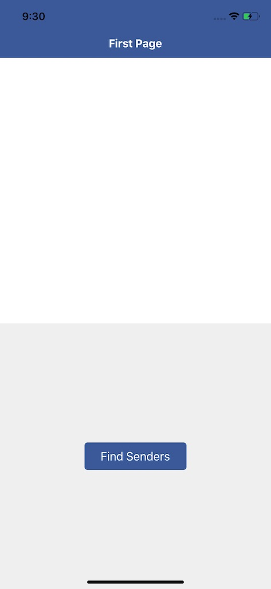
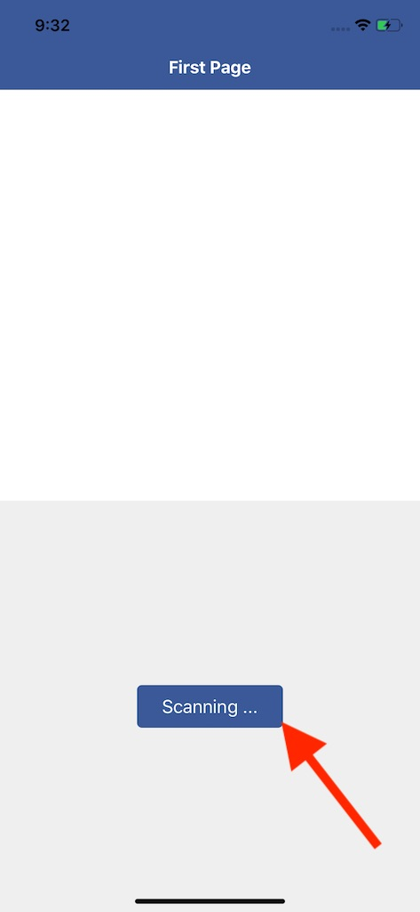
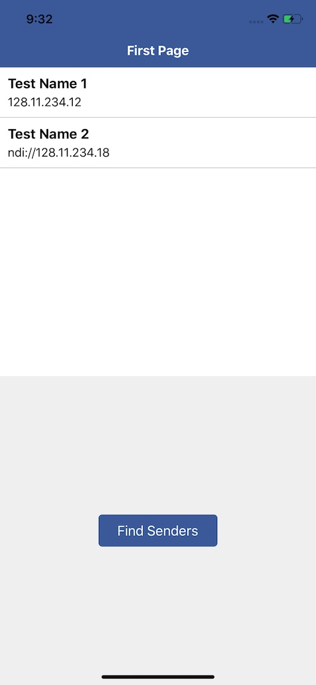

# react-native-ndi-wrapper
 React Native Wrapper for using Ndi SDK 4.5 in iOS

# This is experimental project. Not for use yet!

## Step-1: Clone the repository

## Step-2: Download NDI SDK version 4.5

## Step-3: Copy libndi_ios.a
From the 4.5 NDI SDK, copy libndi_ios.a to ios/NdiSDK_4_5/lib/iOS/ folder
This is 622 MB, thats why I did not push to Github

## Step-4: Running sample app

1. Open Terminal and navigate to RNNdiDemo subfolder. Thats the sample app.
2. On Terminal, run "yarn" to install dependencies.
3. Change directory to ios subfolder
4. Install pods bu running "pod install"
5. Come back to RNNdiDemo folder and run "react-native run-ios"

It will launch the following screen 'First Page'

6. Tap on the 'Find Senders' button to start scan the LAN for senders

7. On scan complete (default 3000 milli seconds), the detected senders are shown in the list as follows 

